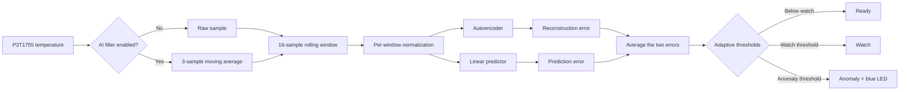

# Model: Penguin — Temperature Anomaly Detector

Penguin is a compact, adaptive temperature-anomaly detector designed to run entirely on a resource-constrained microcontroller. The current reference implementation runs on the NXP FRDM-MCXC162 development board and observes its onboard P3T1755 temperature sensor.

The model combines two independent views of the same temperature history:

1. A neural-network **autoencoder** asks whether the *shape* of the latest temperature window resembles the behavior learned during baseline training.
2. An adaptive **linear predictor** asks whether the newest reading agrees with what the earlier portion of that window predicts.

Their errors are combined into a single anomaly score. A detected anomaly is reported over USB and flashes the board's blue LED. All sampling, normalization, training, inference, scoring, and classification happen on the MCU; no cloud connection is required.

> **Important:** Penguin is an experimental environmental anomaly detector. It is not a medical device, a clinical infant monitor, or a substitute for an independently validated absolute-temperature alarm.

## Project goals

- Detect sudden or structurally unusual changes in a temperature stream.
- Learn the local environment on the MCU instead of requiring a cloud-trained model.
- Operate without dynamic memory allocation.
- Keep computation and model storage small enough for a constrained Cortex-M target.
- Keep anomaly inference independent of the flash-recording interval.
- Expose understandable component errors rather than only a binary alarm.

## Reference system

| Item | Reference implementation |
|---|---|
| Target | NXP FRDM-MCXC162 |
| Temperature sensor | Onboard P3T1755 |
| Temperature sampling | Nominally every 200 ms while recording |
| Analysis window | 16 samples, approximately 3.2 seconds |
| Baseline period | First 128 samples after initialization |
| Model 1 | 16–8–4–8–16 autoencoder |
| Model 2 | Eight-input linear predictor |
| Combined score | Mean of reconstruction and prediction errors |
| Alert output | USB telemetry plus a 500 ms blue LED indication |
| Memory policy | Fixed-size static buffers; no model heap allocation |

## Signal and inference pipeline



The optional AI filter affects only the samples supplied to the models. The temperature displayed by the dashboard and written to the flash logger remains the raw sensor measurement.

## Input window and normalization

Penguin stores the latest 16 samples in a ring buffer. Once the buffer is full, it puts them in chronological order and normalizes that window:

```text
center = mean(window)
scale  = standard deviation(window)
input[i] = (window[i] - center) / scale
```

The scale has a lower bound of `0.05` to avoid division by a very small number when temperature is nearly constant.

Window-by-window normalization makes the models sensitive to pattern shape—jumps, slopes, oscillations, and other changes—while reducing sensitivity to the absolute room temperature. This is useful for behavioral anomaly detection, but it also means Penguin is not an absolute high-temperature or low-temperature safety alarm.

## Model 1: neural autoencoder

### Purpose

The autoencoder learns how a normal 16-sample temperature pattern looks. It compresses the normalized window into a small latent representation and attempts to reconstruct the original window. A pattern unlike the learned baseline is harder to reconstruct and therefore produces a larger error.

### Architecture

```text
16 normalized temperatures
          ↓
8-unit encoder layer, ReLU
          ↓
4-unit latent layer, ReLU
          ↓
8-unit decoder layer, ReLU
          ↓
16-value linear reconstruction
```

The network contains 356 single-precision parameters:

| Layer | Weights | Biases | Activation |
|---|---:|---:|---|
| 16 → 8 | 128 | 8 | ReLU |
| 8 → 4 | 32 | 4 | ReLU |
| 4 → 8 | 32 | 8 | ReLU |
| 8 → 16 | 128 | 16 | Linear |
| **Total** | **320** | **36** | **356 floats / 1,424 bytes** |

The forward-pass workspace is also statically allocated. It holds the intermediate 8-, 4-, and 8-unit layers plus the 16 reconstructed values.

### Reconstruction error

The autoencoder contribution is mean squared error across all 16 normalized values:

```text
reconstruction_error = Σ(input[i] - reconstruction[i])² / 16
```

This error captures disagreement across the entire recent pattern rather than looking only at the newest reading.

### On-device training

Weights start from deterministic pseudo-random values generated from seed `7`, making initialization reproducible. During baseline learning, the network performs online backpropagation with a learning rate of `0.003` on each eligible window.

After baseline training, the autoencoder continues guarded adaptation only when the current combined anomaly score is below the watch threshold. Suspect and anomalous windows are scored but are not used as training targets. This guard reduces the chance that a new anomaly will immediately be learned as normal.

## Model 2: adaptive linear predictor

### Purpose

The predictor provides a second kind of evidence. Instead of reconstructing the entire window, it estimates the newest normalized temperature from earlier samples. A sudden change that violates this learned relationship produces a large prediction error.

### Architecture

The model is intentionally small:

```text
prediction = bias + Σ(weight[i] × input[i]), i = 0…7
```

It has eight single-precision weights and one bias: nine floats, or 36 bytes of parameters.

In the current implementation, the predictor consumes positions `0` through `7` of the normalized 16-sample chronological window and is trained against position `15`, the newest sample. In other words, it uses the first half of the current window to estimate its final value.

### Prediction error

Its contribution to the anomaly score is absolute error:

```text
prediction_error = abs(actual_newest_value - predicted_value)
```

Absolute error keeps the contribution non-negative and treats unexpected upward and downward changes equally.

### On-device training

The predictor uses online gradient updates with a learning rate of `0.01`:

```text
error = actual - prediction
bias += learning_rate × error
weight[i] += learning_rate × error × input[i]
```

It follows the same lifecycle as the autoencoder: initial baseline training followed by guarded adaptation only for windows considered normal.

## Ensemble anomaly decision

The two model outputs are given equal weight:

```text
anomaly_score = (reconstruction_error + prediction_error) / 2
```

Using both models lets Penguin respond to two different failure modes:

- The autoencoder detects an unusual overall window shape.
- The predictor detects disagreement between earlier history and the newest reading.

Neither component alone determines the state. Classification is based on the combined score and thresholds learned during the baseline period.

### Adaptive thresholds

During baseline training, Penguin maintains the running mean and sample variance of the combined error. It then calculates:

```text
watch_threshold   = max(0.08, mean_error + 2 × standard_deviation)
anomaly_threshold = max(0.20, mean_error + 3 × standard_deviation)
```

The fixed minimums prevent an extremely quiet baseline from producing thresholds that are too close to zero.

| State | Meaning |
|---|---|
| `untrained` | Models have been initialized but have not received data. |
| `collecting` | Fewer than 16 samples are available, so no complete window exists. |
| `training` | The baseline is being learned during the first 128 samples. |
| `ready` | The score is below the watch threshold. |
| `watch` | The score is at or above the watch threshold but below the anomaly threshold. |
| `anomaly` | The score is at or above the anomaly threshold. |
| `error` | Reserved for model-service errors. |

## Runtime behavior

The MCU performs temperature sampling and AI processing at a nominal 200 ms cadence while recording is active. This inference cadence is separate from the configurable flash-recording interval. For example, a five-second logger interval still allows the models to analyze approximately 25 sensor samples between stored records.

When the combined model state is `anomaly`:

- USB sample telemetry reports `ai_state: "anomaly"`.
- The telemetry includes reconstruction error, prediction error, and combined score.
- The blue LED is switched on for 500 ms.
- Additional anomalous samples restart the blue LED timer.

The green LED continues to represent recording status, and the red LED represents stopped recording. Those indicators are independent of the blue anomaly alert.

## AI input filter

The optional filter is a three-sample moving average implemented on the MCU:

```text
filtered_temperature = mean(latest three raw sensor samples)
```

At a nominal 200 ms sample cadence, it smooths roughly the latest 600 ms of measurements. Filtering can reduce false alerts caused by single-sample noise, but it can also reduce the magnitude and delay the detection of a genuine abrupt change. The filter setting therefore changes the model input, not merely the dashboard display.

## Training and persistence lifecycle

The model parameters live in MCU RAM. Serialization and checksum routines exist for packaging the autoencoder, predictor, and training-step count, but the current production firmware does not call them to save or restore a trained model.

Consequences:

- Stopping and restarting recording without resetting the MCU retains the learned model.
- Resetting or power-cycling the MCU initializes new deterministic weights and repeats baseline training.
- Flash-recorded temperature history survives independently of the in-RAM model state.

A future persistence implementation should store model data in a dedicated, wear-managed region and validate its version, size, and checksum before restoration.

## Telemetry fields

The reference firmware emits newline-delimited JSON over USB serial at 115200 baud. AI-related sample fields include:

| Field | Description |
|---|---|
| `ai_filter` | Whether the MCU-side three-sample filter is enabled. |
| `ai_state` | Current lifecycle or classification state. |
| `ai_error` | Autoencoder reconstruction mean squared error. |
| `ai_prediction_error` | Linear predictor absolute error. |
| `ai_score` | Equal-weight mean of the two errors. |

## Source implementation

The current reference source is maintained in the EmbeddedX repository:

- [Model service and ensemble logic](https://github.com/telespial/EmbeddedX_V2_0/blob/main/projects/manufacturers/NXP/FRDM/MCXC162/ai/baby_temp_service.c)
- [Autoencoder implementation](https://github.com/telespial/EmbeddedX_V2_0/blob/main/projects/manufacturers/NXP/FRDM/MCXC162/ai/baby_temp_ae.c)
- [Linear predictor implementation](https://github.com/telespial/EmbeddedX_V2_0/blob/main/projects/manufacturers/NXP/FRDM/MCXC162/ai/baby_temp_predictor.c)
- [MCXC162 firmware integration](https://github.com/telespial/EmbeddedX_V2_0/blob/main/projects/manufacturers/NXP/FRDM/MCXC162/firmware/main.c)
- [Host-side model tests](https://github.com/telespial/EmbeddedX_V2_0/tree/main/projects/manufacturers/NXP/FRDM/MCXC162/ai)

## Validation strategy

The model package includes host-side tests for:

- Autoencoder forward propagation and reconstruction error.
- Predictor output and absolute prediction error.
- Service training and status reporting.
- A large synthetic temperature excursion producing an anomaly.
- Model serialization, restoration, and checksum rejection.

Hardware validation should additionally measure real sensor cadence, baseline behavior, anomaly response latency, false-alert rate, and blue LED timing. Host tests do not replace validation on the target board.

## Known limitations

- Per-window normalization emphasizes pattern changes rather than absolute temperature limits.
- The first 128 samples form the baseline; a disturbance during startup can influence learned behavior.
- Training data comes from the current device and environment, not from a diverse population dataset.
- The three-sample filter trades some response speed for noise reduction.
- The current firmware does not persist trained parameters across reset or complete power loss.
- Detection quality has not been clinically validated.
- Thresholds and learning rates require empirical characterization across sensors, boards, and environments.

For safety-related use, pair Penguin with independent deterministic high/low limits, sensor fault detection, watchdog behavior, and a validated alert path.

## License

This project is released under the repository's [MIT License](../LICENSE).

Copyright © 2026 Richard Haberkern.
